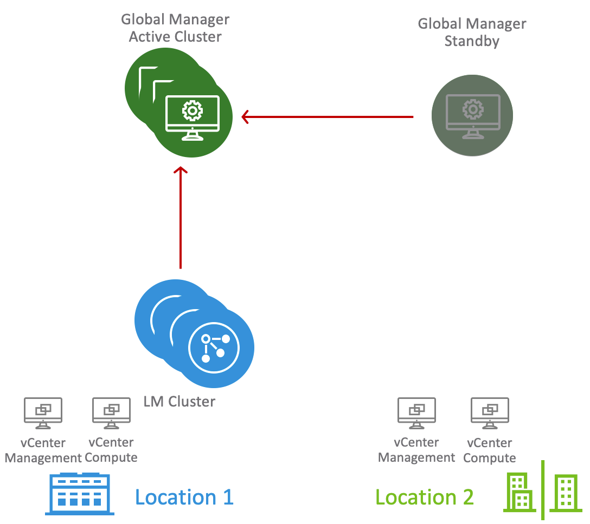

# Federation Setup

# Overview
This set of playbooks in this example show how to deploy Local & Global NSX Managers to support a Federation deployment. This example deploys one site with one Local Manager cluster and one Global Manager Cluster. It also registers the Local Manager Site with the Global Manager. It also shows an example how to deploy and register a Standby Global Manager with the Active Global Manager Cluster. The playbooks can be copied and used for a second site and required vCenter details for that site can be added in the variables.yml file.



There are the following playbooks and a common variable file:

* answerfile.yml: This is where all variables are recorded and should be changed to match your environment. 

* 01_first_lm_deployment.yml: Deploys first NSX Manager appliance.
* 02_configure_lm_compute_manager.yml: Configures vCenter(s) as Compute Managers in NSX
* 03_deploy_second_third_lm.yml: Deploys second and third Local NSX Manager
* 04_add_nsx_license.yml
* 05_local_managers_vip.yml: Configures Local Managers VIP.
* 06_first_gm_deployment.yml: Deploys first Global NSX Manager
* 07_configure_gm_compute_manager.yml: Configures vCenter(s) as Compute Managers in NSX
* 08_global_manager_enable_service.yml: Make the Global Manager Active.
* 09_deploy_second_third_gm.yml: Deploys second and third NSX Global Managers
* 10_global_managers_vip.yml: Configures Local Managers VIP.
* 11_first_standby_gm_deployment.yml: Deploys first Standby Global NSX Manager
* 12_register_standby_global_manager.yml: Registers Standby Global NSX Manager
* 13_register_lm_with_gm.yml: Registers Local Managers with Global Managers as a Site. 

To delete all objects, change the 'state' to 'absent' in the variables file and run the playbooks and steps in the following order:

* 13_register_lm_with_gm.yml
* 12_register_standby_global_manager.yml
* Delete the Standby Global Manager(s) using vSphere UI. 
* 10_global_managers_vip.yml
* Delete the second and third Global Managers using NSX UI.
* 07_configure_gm_compute_manager.yml
* Delete the first Global Manager using vSphere UI.
* 05_local_managers_vip.yaml
* 04_add_nsx_license.yml
* Delete the second and third Local Managers using NSX UI.
* 02_configure_lm_compute_manager.yml
* Delete the first Local Manager using vSphere UI

Also included is the ```XX_configure_standby_gm_compute_manager.yaml``` playbook to configure Compute Manager on the Standby Global Manager and the ```XX_deploy_second_third_standby_gm.yaml```  to deploy the Second and Third Standby Global Managers.

Validated against:
* NSX-T 3.1 GA
