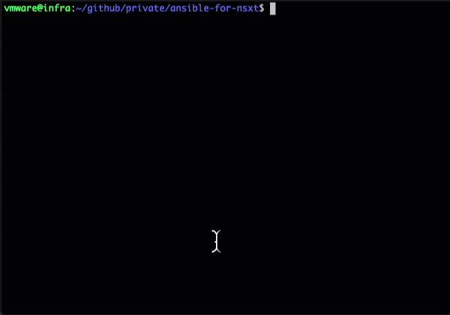
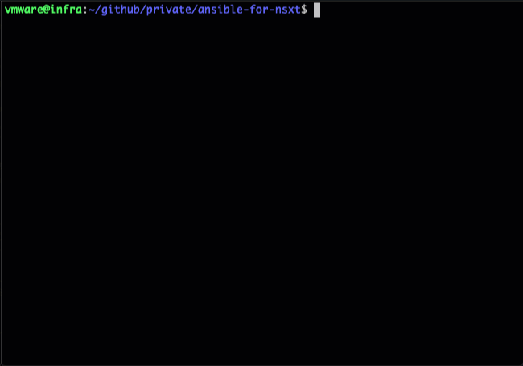

# NSX-T Automation using Ansible

## Overview

Creates the following items:
- Tier-0
- 2 Tier-1
- 1 Segment in each Tier-1 (2 in total)
- 4 Groups
- 3 Security Policies
- 4 Rules in total


## Requirements
* NSX-T configured with:
  - At least one Transport Zone
  - At least one Edge Cluster (with one or more Edges)
* NSX-T Ansible modules
  - `git clone https://github.com/vmware/ansible-for-nsxt.git`

## Usage
Copy the playbooks provided into the folder from git clone

### Creation
`ansible-playbook 3-tier-app-create.yml`

### Deletion
`ansible-playbook 3-tier-app-delete.yml`

**Note**

The playbook `3-tier-app-Segments.yml` contains a reference to the precreated Transport Zone:
```
19:        display_name: "ANS-3Tier"
20:        transport_zone_display_name: "Overlay-TZ"
21:        tier1_id: "ANS-VMW-T1"
```
Change the given Transport Zone `Overlay-TZ` to the one from your setup

## Sample Run:

### Create


### Delete

