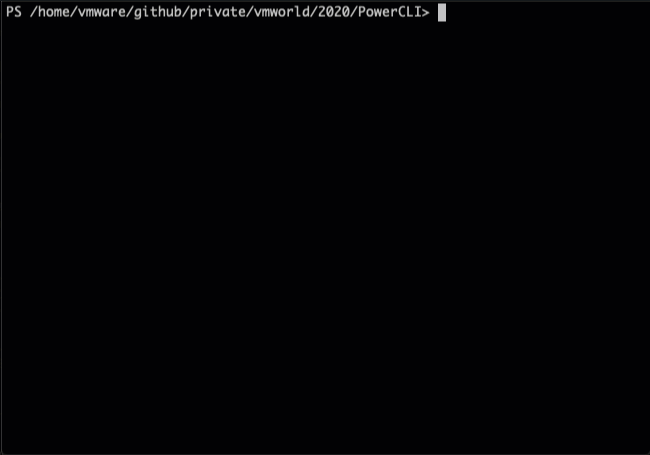

# NSX-T Automation using PowerCLI


## Overview

Creates the following items:
- Tier-0
- 2 Tier-1
- 1 Segment in each Tier-1 (2 in total)
- 4 Groups
- 3 Security Policies
- 4 Rules in total

## Requirements
* NSX-T configured with:
  - At least one Transport Zone
  - At least one Edge Cluster (with one or more Edges)
* PowerShell and PowerCLI installed


## Usage
The provided script can be used to create or delete the objects

### Create
`pwsh> 3-Tier-app.ps1`


### Delete
`pwsh> 3-Tier-app.ps1 delete`


**Note** - The provided script refers to existing Transport Zone and Edge Cluster:

```
188:    createT0 "PCLI-3Tier-T0" "Edge-Cluster-01"
189:
190:    createT1 "PCLI-VMW-T1" "PCLI-3Tier-T0" "Edge-Cluster-01"
191:    createT1 "PCLI-Client-T1" "PCLI-3Tier-T0" "Edge-Cluster-01"
192:
193:    createSegment "PCLI-3Tier" "PCLI-VMW-T1" "192.20.10.1/24" "Overlay-TZ"
```
Use the appropriate Edge Cluster and Transport Zone from your setup


## Sample Run

### Create


### Delete

