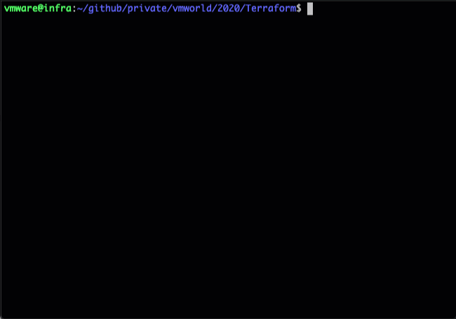

# NSX-T Automation using Terraform

## Overview

Creates the following items:
- Tier-0
- 2 Tier-1
- 1 Segment in each Tier-1 (2 in total)
- 4 Groups
- 3 Security Policies
- 4 Rules in total

## Requirements
* NSX-T configured with:
  - At least one Transport Zone
  - At least one Edge Cluster (with one or more Edges)
* Terraform is installed
* Terraform init is done (`terraform init`)

## Usage
The provided configuration file can be used to create and delete objects. Download/Copy/Clone the script locally and issue the below commands from that folder

### Create
`terraform apply --auto-approve`

### Delete
`terraform destroy --auto-approve`


**Note** - The provided configuration file uses Edge Cluster and Transport Zone:
```
14: data "nsxt_policy_edge_cluster" "demo" {
15:   display_name = "Edge-Cluster-01"
16: }
17:
18: data "nsxt_policy_transport_zone" "overlay_tz" {
19:   display_name = "Overlay-TZ"
20: }
```

Change the Edge Cluster (line 15) and Transport Zone (line 19) to the ones from your setup

## Sample Run

### Create


### Delete

