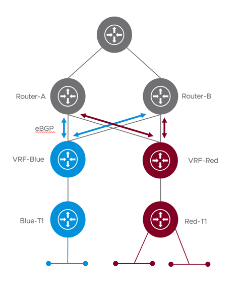

This Terraform NSX-T Provider example can be useful to quickly deploy a typical VRF multi-tenant topology on a NSX-T environment and configures the following NSX-T objects: 

- Active-Active Tier-0 Gateway
- Uplink interfaces on the Tier-0 Gateway and VRFs
- Two Tier-0 VRFs
- Two Tier-1 Gateways
- BGP Configuration on the Tier-0 Gateway
- BGP Neighbor Configuration on VRF
- Tier-1 Gateways, one per Tenant VRF.
- Route Advertisement rule on the Tier-1
- Segments connected to Tier-1
- VLAN101 and Trunk Segment for north-south traffic and BGP peering with ToR-A
- VLAN102 and Trunk Segment for north-south traffic and BGP peering with ToR-B
- Security Groups for the Web, App and DB tiers based on Tags
- Security Groups for Red and Blue Tenant Virtual Machines
- Custom Service (TCP 8443) for Web to App communication.
- Some example Distributed Firewall Rules for accessing the Application and communication between the tiers, including a default deny rule and using Applied To.

Requirements:
- NSX Manager(s) ready and configured
- Compute Manager configured
- Overlay and VLAN Transport Zones configured
- Two Edge Nodes configured
- Edge Cluster configured with the two Edge Nodes as members.

Logical diagram of the topology

