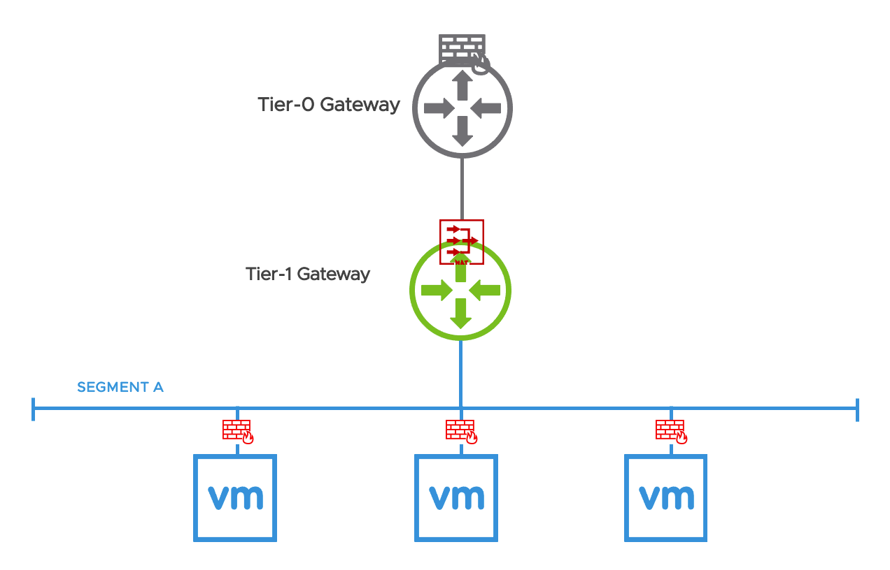

# NSX-T Automation with vRA - Micro-segmentation

## Introduction
This is an example of a vRA Cloud Template which deploys a 3-Tier Application with a single NSX Segment and Tier-1 Gateway.
Each Tier is secured with on-demand Security Groups. Additionally this demo leverages vRA 8.4 feature capability of using NSX-T security tags for day 0 and day 2 operations.

## Overview
This Cloud Templates creates the following topology

The following objects will be created:
- 1 Tier-1 Gateway with SNAT rules configured for the Outbound Network type
- 1 Segment
- 3 VMs for Web, App and DB Tiers
- 4 Security Groups, one for each Tier and one to group to deny SSH into all Application VMs
- 1 Security Tag which is associated with the three VMs and one Segment Port (Web VM). This is to demonstrate that Tags can be associated with both VMs and Segment Ports

## Requirements
* NSX-T configured with:
  - At least one Transport Zone
  - At least one Edge Cluster (with one or more Edges)
  - Tier-0 Gateway pre-provisioned
  - vRA installed and configured with NSX-T. 
  - A Network Profile configured with on-demand networks, CIDR and Capability Tags.
  - Available VM Templates

## Usage

Cloud Templates are YAML type files which can be Imported/Copy-Pasted in the Cloud Template into your vRA to customize and deploy.